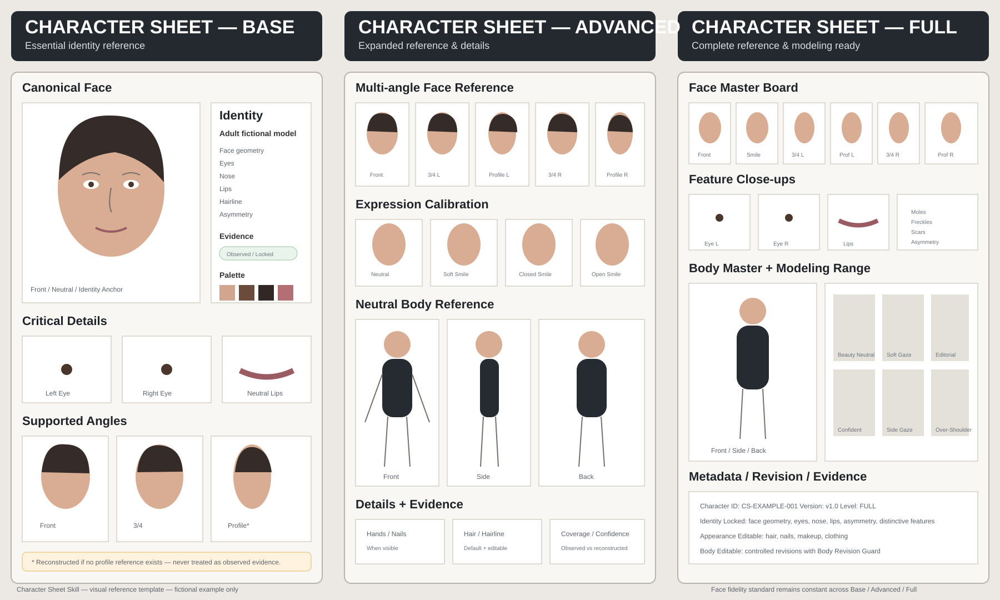
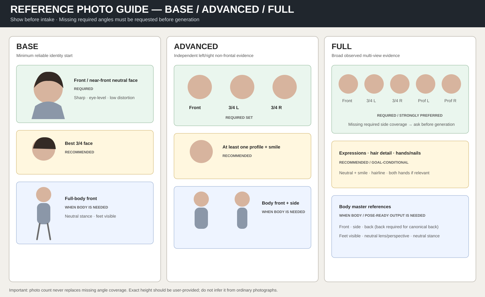

# Character Sheet Skill

A reusable AI skill for building identity-consistent, revision-ready character sheets from real photographs.



The bundled preview is a fictional visual template. It communicates output structure, not evidence about any real person.

The skill is designed around a strict principle:

> Character-sheet depth and evidence confidence may change, but the minimum facial identity acceptance standard must not be downgraded.

It can start from a single usable photograph, scale to large photo sets, automatically select the most useful references, build a structured identity profile, generate Base / Advanced / Full character sheets, and keep later edits from unintentionally redefining the person.

For repeated realistic outputs in varied poses, the skill also builds a pose-ready control layer: a canonical body proxy, explicit pose contracts, separate camera/lighting contracts, capability-based generation routing, anatomy/occlusion QC, and a visual benchmark from neutral through extreme articulation.

## Release status

Current production release: `v1.1.0`

The installable package is:

`character-sheet-skill-v1.1.0.zip`

The repository keeps development/test files separate from the install package. The ZIP contains only the runtime Skill files and supporting resources.

See:

- `VERSION`
- `CHANGELOG.md`
- `docs/FINAL-RELEASE-CHECKLIST.md`

## Install on ChatGPT for Windows

### Requirements

You need:

- the ChatGPT desktop app for Windows;
- a ChatGPT workspace/account where **Skills** are available;
- permission to upload/install Skills in that workspace.

OpenAI currently documents Skills for eligible `Business`, `Enterprise`, `Healthcare`, and `Edu` users, subject to workspace settings and product availability. If you do not see the **Skills** tab, your workspace may not support Skills yet or an administrator may have disabled skill creation/uploading.

Official OpenAI references:

- Skills in ChatGPT: https://help.openai.com/en/articles/20001066
- ChatGPT Windows app: https://help.openai.com/en/articles/9982051-using-the-chatgpt-windows-app
- ChatGPT desktop / Work: https://help.openai.com/en/articles/20001275

### Step 1 — Download the official Release ZIP

**Recommended: use the GitHub Release**

Release page:

https://github.com/pooyahayati/Character-Sheet-Skill/releases/tag/v1.1.0

Direct download:

https://github.com/pooyahayati/Character-Sheet-Skill/releases/download/v1.1.0/character-sheet-skill-v1.1.0.zip

Checksum:

https://github.com/pooyahayati/Character-Sheet-Skill/releases/download/v1.1.0/SHA256SUMS.txt

The file you install into ChatGPT is:

`character-sheet-skill-v1.1.0.zip`

**Alternative 1: GitHub Actions artifact**

Open **Actions → latest successful Validate Skill run** and download the `character-sheet-skill-v1.1.0` artifact.

**Alternative 2: build the ZIP locally on Windows**

Requires Python 3.11+.

```powershell
python scripts/package_skill.py
```

Output:

```text
dist/character-sheet-skill-v1.1.0.zip
```

Optional validation:

```powershell
python scripts/package_skill.py --check dist/character-sheet-skill-v1.1.0.zip
```

### Step 2 — Install in the ChatGPT Windows app

1. Open the ChatGPT Windows app and sign in.
2. In the left sidebar, select **Plugins**.
3. In the Plugin Directory, open the **Skills** tab.
4. Select **Create**.
5. Select **Upload from your computer**.
6. Choose:
   `character-sheet-skill-v1.1.0.zip`
7. Wait for ChatGPT's skill scan to finish.
8. If the skill is marked **Needs Review**, review it before enabling.
9. Install/enable the Skill.

If your workspace already shared the Skill with you, use:

`Skills → Shared with me / Shared by <workspace> → ••• → Install`

### Step 3 — Start a clean project

For the first real test, use a clean environment rather than the development chat.

1. Create a new ChatGPT Project, for example:
   `Character Sheet Test`
2. Start a new **Chat** inside that Project.
3. Do not copy the internal architecture or expected answers into the test chat.
4. Type `@` and select **Character Sheet Skill** to invoke it explicitly, or allow ChatGPT to trigger it automatically when relevant.
5. Upload the subject photographs in that new chat.

### Recommended first prompt — Persian

```text
می‌خواهم از این عکس‌ها یک Character Sheet دقیق، فوتورئال و قابل استفاده برای تولید همین شخص در پوزیشن‌ها و زاویه‌های مختلف بسازی. ابتدا عکس‌ها را بررسی کن، بهترین رفرنس‌ها را انتخاب کن و فقط اگر اطلاعات مهمی واقعاً کم است از من عکس یا اطلاعات تکمیلی بخواه.
```

### Recommended first prompt — English

```text
Build a precise, photorealistic, pose-ready Character Sheet from these photos so I can reproduce the same person consistently across different poses and camera angles. Analyze and select the best references first, and only ask me for additional references when a material gap truly blocks the target quality.
```

### Recommended reference set

A strong first test often uses 10–20 varied images when available:

- neutral front face;
- left and right 3/4 views;
- at least one useful profile;
- neutral and smiling expressions;
- full-body front/side where possible;
- a few natural candid images;
- hands visible in at least one useful reference when hand identity matters.

Photo count is not the goal. Coverage, reliability, camera diversity, and useful detail are more important.

### After the Character Sheet is approved

Use the approved character as the canonical identity.

Examples:

```text
Using the approved character identity, create a full-body walking pose with a normal camera perspective. Preserve face identity, body proportions, hair identity and skin texture.
```

```text
Generate a seated three-quarter pose. Keep the canonical body proportions unchanged, allow realistic clothing folds, and validate the face and hands before approval.
```

```text
Create a P4 self-occluding pose with crossed arms. Use the strongest available pose/geometry control and reject the output if hand anatomy, occlusion ordering or identity consistency fails.
```

For a full clean-room pose-readiness test, progress from `P0` through `P5` instead of jumping directly to the hardest pose.

Detailed Windows installation and usage guide:

`docs/INSTALL-CHATGPT-WINDOWS.md`

## What this skill is designed to preserve

- Face geometry and facial proportions
- Left/right eye identity, eyelids, iris appearance, brow-eye relationship and natural asymmetry
- Nose, jaw, lips and mouth geometry
- Smile behavior when supported by reference images
- Hairline and default hair characteristics
- Distinctive visible features such as moles, freckles, scars or dimples
- Body proportions and shape within the limits supported by the references
- Subject-left vs subject-right feature placement
- Identity consistency across poses, expressions, camera angles and revisions

## Core workflow

```text
Start
→ Show expected character-sheet preview
→ Normalize build request / goal / authorization / age handling
→ Ask goal + height + authorization/output preferences
→ Show Base / Advanced / Full reference-photo guide
→ Collect one or more photos
→ Normalize orientation/encoding/size + duplicate triage
→ Staged Reference Image Selection
→ Mandatory Coverage Audit
→ Request exact missing angles before generation
→ Face Identity Gate
→ Coverage analysis
→ Select Base / Advanced / Full
→ Build Canonical Character Identity
→ Build Multi-view Identity Anchor Bank
→ Build Body Proxy / Pose Readiness when needed
→ Create Sheet Plan + Preflight call/file/compute estimate
→ Create Pose + Camera/Lighting Contracts
→ Generate independent panel groups in parallel where supported
→ Per-panel multi-gate quality control
→ Repair / escalate failed panels
→ Cross-panel Identity Matrix
→ Deterministic composition
→ User approval
→ Approved Character v1.0
→ Revision / Expansion / Level Upgrade
```

## Visual output standard

The production layout and panel hierarchy are defined in:

- `docs/VISUAL-STANDARD.md`
- `docs/LEVEL-SPECS.md`
- `examples/sheet-layout-spec.json`

The canonical face is always the strongest visual anchor. Modeling poses are secondary. Reconstructed or estimated information must never be visually presented as directly observed evidence.

## Build request and level choice

The skill normalizes the production goal before selecting a level. Explicit Base / Advanced / Full requests are respected when supported; Auto selects the smallest sufficient level.

The normative level rules live in `config/level-contract.json`.

## Character-sheet levels

### Base

For limited but usable reference coverage. A good facial reference is mandatory.

Typical output includes the strongest supported facial views, close-up face and eye references, basic body reference, default hair, color palette, observed attributes, editable defaults and uncertainty labels.

### Advanced

For broader multi-angle reference coverage.

Adds stronger left/right angle coverage, better profile reconstruction, full-body views where supported, improved body geometry, hair details, expression references and hand/nail information when visible.

### Full

For broad, high-quality reference coverage with low uncertainty for the requested production goal.

Requires broad left/right/profile facial evidence. Expression, body, back-view, hands/nails, and modeling coverage become required only when the production goal needs them. Unsupported views remain explicitly Reconstructed rather than being presented as observed evidence.

**Important:** the number of photos alone never determines the level. Coverage, reliability, diversity and image quality do.

## Reference-photo intake guide

Before asking for uploads, the Skill shows:



The guide tells the user which views are required or recommended for each evidence level. Missing required angles are detected before generation.

## Reference Image Selection System

When many images are provided, the skill does not treat every image equally. It:

- scores image quality and identity reliability;
- detects near-duplicates;
- clusters face angles and expressions;
- maps body/detail coverage;
- detects heavy filters, distortion and misleading perspectives;
- separates current appearance from older or conflicting appearance;
- identifies identity outliers;
- chooses a Primary Reference Set;
- retains useful remaining images as a Validation Pool.

A photograph can be excellent for eyes but unsuitable for body proportions. Utility is evaluated per feature, not only per image.

## Identity model

The character profile separates:

- `Identity Locked` — core identity features;
- `Appearance Editable` — hair color/length/style, nails, makeup, clothing and similar appearance variables;
- `Body Editable` — controlled body-shape edits that require stronger consistency checks.

The internal identity representation includes:

- Face Geometry Core
- Facial Proportion Fingerprint
- Natural Asymmetry
- Eye Identity
- Mouth & Lip Identity
- Smile / Expression Model
- Distinctive Feature Map
- Hair Identity
- Body Geometry
- Editable Appearance

## Attribute state model

Every extracted attribute keeps three independent dimensions:

- evidence basis: `Observed`, `Cross-Validated`, `Estimated`, `Reconstructed`, `Unverified`, or `User-Provided`;
- revision state: `Original` or `Edited`;
- lock state: `Identity-Locked`, `Appearance-Editable`, `Body-Editable`, or `Unlocked`.

This allows a feature to be simultaneously, for example, `Cross-Validated` and `Identity-Locked`.

The skill must never turn an estimate into a fact merely because it appeared in a generated image.

## Minimal questioning

The skill analyzes the references before asking questions.

If a feature can be extracted and internally validated with sufficient confidence, it should not ask the user for that information. It asks only when the information is important and ambiguous, conflicting, unobservable or insufficiently supported.

## Face-first quality gates

A generated sheet is not accepted on global similarity alone. Independent gates verify:

- face geometry;
- facial proportions;
- eyes;
- nose;
- mouth and lips;
- smile behavior;
- jaw;
- hairline;
- distinctive features;
- natural asymmetry;
- body geometry;
- expression / pose consistency;
- full-body face fidelity.

A severe failure in a critical region cannot be hidden by a high overall similarity score.

## Body measurements and proportions

The skill may infer **relative visual proportions** from suitable references.

It must not claim exact real-world height, weight, chest, waist, hip or other physical measurements from ordinary photographs unless the user provides the measurement or the image has a trustworthy scale/calibration reference.

Camera distortion, focal length, pose and perspective must be considered before using an image for body geometry.

## Default character-sheet clothing

The default sheet uses minimal, neutral, anatomically readable, non-sexualized clothing that keeps body proportions visible without presenting the subject sexually.

## Revision-ready by design

The first approved sheet becomes the canonical base character.

Small appearance changes may create versions such as `v1.1`, while major structural changes may create `v2.0`. Later edits should change only the requested attributes, followed by identity and body consistency checks.

A Base sheet can later be upgraded to Advanced or Full as new references are supplied without rebuilding the identity from scratch.

## Privacy and body revisions

Real-person builds record authorization and age handling. Raw user photographs must not be committed to this public repository. Controlled body edits follow `docs/BODY-REVISION-GUARD.md`, including protected invariants and adult-confirmation requirements for sexualized secondary-characteristic edits.

See `docs/PRIVACY-CONSENT.md`.

## Multi-view realism controls

Production no longer relies on one frontal face anchor. It uses a multi-view identity anchor bank and validates approved panels against each other before final composition.

Additional production assets model:

- left/right hand and foot identity;
- visible skin identity independent from lighting;
- static hair identity plus pose-dependent dynamics;
- clothing deformation independent from body shape;
- explicit camera and lighting state per panel.

See:

- `docs/MULTIVIEW-IDENTITY.md`
- `docs/EXTREMITY-IDENTITY.md`
- `docs/SKIN-HAIR-CLOTH.md`
- `docs/CAMERA-LIGHTING.md`

## Pose-ready production

`Base / Advanced / Full` describe sheet/evidence depth. Pose readiness is independent:

- `Not-Ready`
- `Basic`
- `Strong`
- `Production`

A `Full` character is not automatically ready for difficult full-body posing.

Pose-ready production can use a `SMPL-X`-compatible proxy, `SMPL`, a 3D skeleton, depth/normal controls, or a weaker 2D fallback depending on backend capability. P3-P5 poses should route to structural 3D/depth/normal control rather than reference-only generation.

See:

- `docs/POSE-READINESS.md`
- `docs/GENERATION-ROUTER.md`
- `docs/PHYSICAL-PLAUSIBILITY.md`
- `docs/VISUAL-BENCHMARK.md`

## Output modes

Default: `Quick-Sheet`.

This delivers the visual sheet and compact summary without forcing the full machine-readable production package.

Use `Production-Package` only for reusable downstream identity assets, repeated generation, or explicit structured delivery.

## Production

The production path is explicitly panel-by-panel. The skill first approves a Multi-view Identity Anchor Bank, then generates and validates each panel independently with explicit pose and camera/lighting controls, checks cross-panel identity consistency, and finally composes the approved panels deterministically.

See:

- `docs/PRODUCTION-PIPELINE.md`
- `docs/GATE-CONTRACT.md`
- `schemas/sheet-manifest.schema.json`
- `scripts/compose_sheet.py`

## Validation

Validation is executable in CI. `scripts/validate_repo.py` checks schemas, examples, cross-file reference integrity, the canonical level contract, group-photo exclusion behavior, and scenario uniqueness. The deterministic compositor is smoke-tested on every push and pull request.

The repository also includes a scenario-based regression suite covering single-photo intake, large duplicate sets, mixed time periods, identity outliers, filters, occluders, smile-only references, mirrored laterality, perspective distortion, modeling poses and revision workflows.

See:

- `tests/SCENARIO-VALIDATION.md`
- `tests/scenario-matrix.json`

## Repository structure

```text
SKILL.md
README.md
VERSION
LICENSE
CHANGELOG.md
package-manifest.json
assets/
  character-sheet-levels-example.svg
docs/
  ARCHITECTURE.md
  QUALITY-CONTROL.md
  REFERENCE-SELECTION.md
  VISUAL-STANDARD.md
  LEVEL-SPECS.md
  EXAMPLE-SHEET-LAYOUT.md
  PRODUCTION-PIPELINE.md
  GATE-CONTRACT.md
  REQUEST-CONTRACT.md
  OUTPUT-CONTRACT.md
  BODY-REVISION-GUARD.md
  PRIVACY-CONSENT.md
  POSE-READINESS.md
  GENERATION-ROUTER.md
  PHYSICAL-PLAUSIBILITY.md
  VISUAL-BENCHMARK.md
  MULTIVIEW-IDENTITY.md
  EXTREMITY-IDENTITY.md
  SKIN-HAIR-CLOTH.md
  CAMERA-LIGHTING.md
  INSTALL-CHATGPT-WINDOWS.md
  FINAL-RELEASE-CHECKLIST.md
config/
  level-contract.json
  pose-readiness-contract.json
  generation-routing.json
  visual-benchmark.json
schemas/
  build-request.schema.json
  reference-analysis.schema.json
  character-profile.schema.json
  level-contract.schema.json
  sheet-plan.schema.json
  sheet-manifest.schema.json
  build-report.schema.json
  body-proxy.schema.json
  pose-contract.schema.json
  pose-readiness.schema.json
  generation-route.schema.json
  visual-benchmark.schema.json
  visual-benchmark-result.schema.json
  identity-anchor-bank.schema.json
  cross-panel-identity-matrix.schema.json
  extremity-profile.schema.json
  skin-identity.schema.json
  hair-dynamics.schema.json
  clothing-behavior.schema.json
  camera-lighting-contract.schema.json
scripts/
  compose_sheet.py
  validate_repo.py
  package_skill.py
examples/
  sample-build-request.json
  sample-reference-analysis.json
  sample-character-profile.json
  sample-sheet-manifest.json
  sample-body-proxy.json
  sample-pose-contract.json
  sample-generation-route.json
  sample-pose-readiness.json
  sample-visual-benchmark-result.json
  sample-identity-anchor-bank.json
  sample-cross-panel-identity-matrix.json
  sample-extremity-profile.json
  sample-skin-identity.json
  sample-hair-dynamics.json
  sample-clothing-behavior.json
  sample-camera-lighting-contract.json
  sheet-layout-spec.json
tests/
  SCENARIO-VALIDATION.md
  scenario-matrix.json
```

## Author

**Pooya Hayati | پویا حیاتی**

https://Pooyahayati.com
